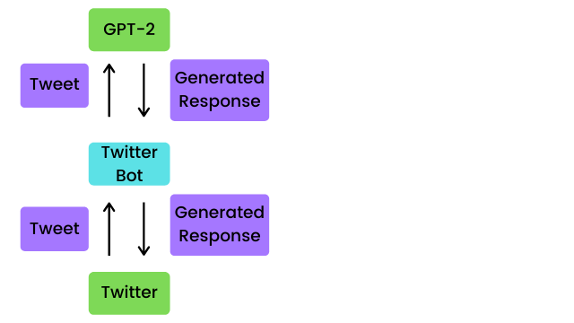

# **Project ContentGen**

## **Problem Statement:**

The influencer marketing industry is expected to be worth 15 billion dollars by 2022 up from as much as 8 billion dollars from 2019 according to business insider. How can companies utilize this booming marketing channel without spending upwards of 100,000 - 500,000 dollar a year in influencer marketing? By creating and owning their own influencers. Instead of paying salaries for a photographer, videographer, editor, and models these companies can pay a monthly fee and get access to an infinite amount of computer generated content and influencers.  

## **Project Layout**

### Creating the Computer Generated Influncer:
There will be two parts of this project. The first part will be the computer generated influencer. I will be utilizing [StyleGan2](https://github.com/NVlabs/stylegan2) from NVIDIA. One will be for the face and the other will be for the body of the person. After those are generated I will merge the two together creating a final Instagram post. I can then take this person and put them in [vid2vid](https://github.com/NVIDIA/vid2vid) and create a generated dance much like the one here: [TikTok Video](https://vm.tiktok.com/ZMJD8tqGu/).

### Creating the Tweet Generator:
Onto the second part of the project. This step will be utilizing a Twitter bot to stream live tweets about a certain topic which will be art. The bot will feed the tweets in GPT-2 and then GPT-2 will be generate a response to that tweet and comment that resonspe back to the original tweet. Since this influencer will be interested in art I hope she can build influencer within this community over time evenually leading up to the ability to create and sell her own art.

Down below is flowchart on how this process will work under the hood. As long as the bot is running the portion of the project should be able to run forever in the background eventually up on a server.

## **Data**

**Influencer Generation Data:**  
I will be using for the first inital run, the dataset provided by NVIDIA in their StyleGan2 repo. I will be looking for more face data or potentially even take pictures of my friends and get pictures of people from our cohort. For generating the bodies of the people I will be using this dataset [here](https://www.robots.ox.ac.uk/~vgg/data/pose/index.html#downloadlink). I am still working out the best way to download these files, either to an external hardrive or google drive. The video I will be using as my base for the TikTok video is [here](https://vm.tiktok.com/ZMJD8tqGu/).

**Tweet Generator:**  
Since I will be using GPT-2 as my tweet generator I will only need to train it on the tweets for a certain topic which I chose as art. After feeding it a handful of tweets it should begin to reply hopefully human-like.
